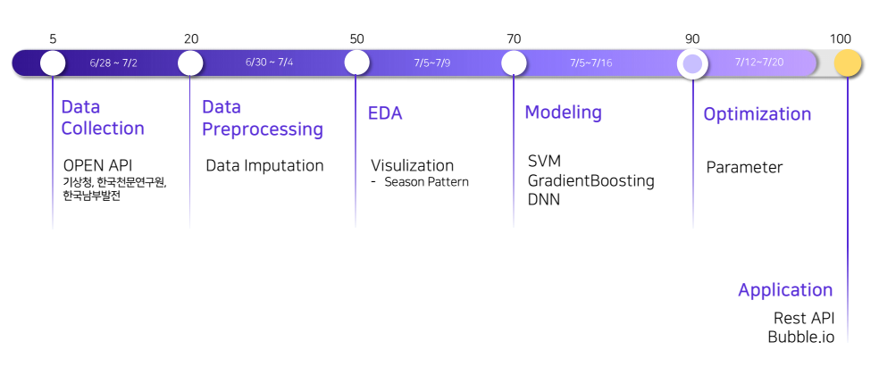
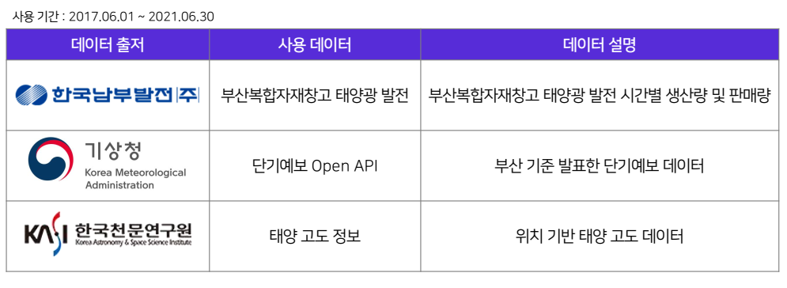
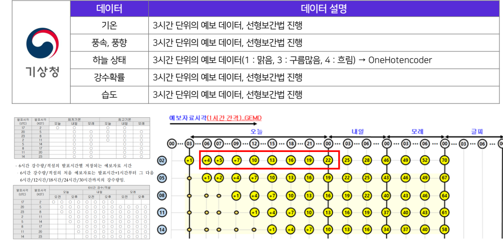
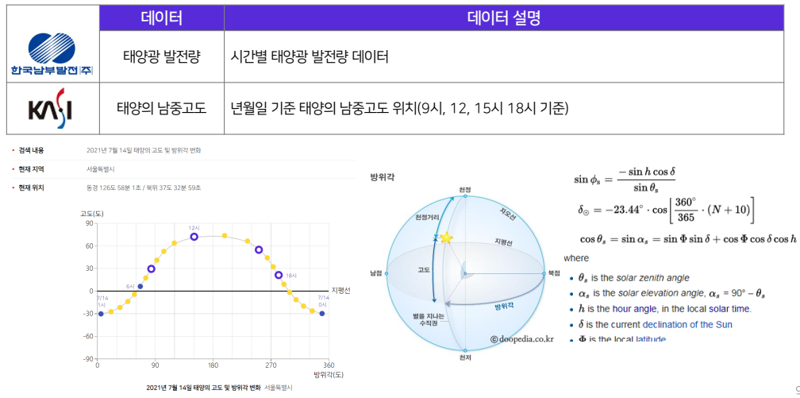
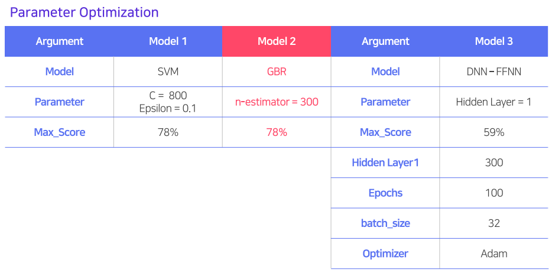
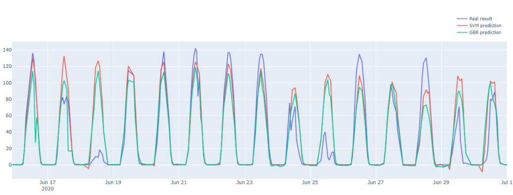
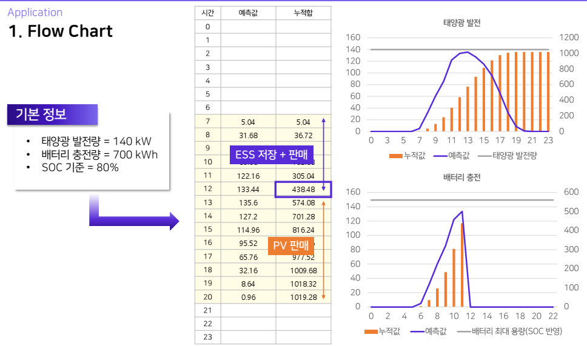

# 태양광발전 발전량 예측 기반 ESS 운영 방안 제공 서비스  
> 지역별 태양광 발전데이터와 날씨데이터 등을 수집하여 인공지능 기반으로 발전량을 예측하여 최적 ESS 운영방안 제시

## Introduction
- Full demo video  [ [link](https://youtu.be/bqdp7wjlU8k) ]
- Final Report  [ [link](https://github.com/goareum93/2021_KDT_hackathon/blob/master/06%2C%20Submition/Final/1.%20renewable_PPT.pdf) ]

## Project Process

## Dataset

## Models

- 

## Evaluation

## Application

- AI Hub Korean-English translation corpus was used for fine tuning. [ [link](https://aihub.or.kr/aidata/87) ]
- Plus, We add the situation data made by English text book.

## PV+ESS algorithm

## Reference

[[link](https://www.notion.so/Main-b73c0f98c9d743e9ae39d6311c4003eb)]

